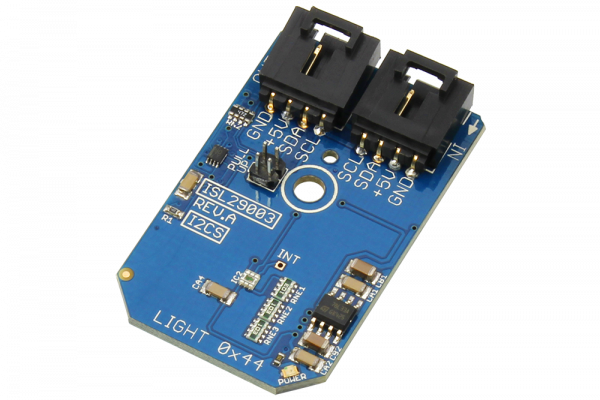

# ISL29003

The ISL29003 is a light sensor with an internal analog-to-digital converter (ADC) that provides 16-bit resolution while rejecting 50Hz and 60Hz flicker caused by artificial light sources.This device offers user-programmable gain from 0-64,000 lux.The ISL29003 also offers a power-down mode.The ISL29003 allows two devices to share a single I2C port.
This Device is available from www.ncd.io 

[SKU: ISL29003_I2CS]

(https://store.ncd.io/product/isl29003-light-sensor-with-programmable-gain-0-64000-lux-16-bit-i2c-mini-module/)
This Sample code can be used with Arduino.

Hardware needed to interface ISL29003 sensor with Arduino

1. <a href="https://store.ncd.io/product/i2c-shield-for-arduino-nano/">Arduino Nano</a>

2. <a href="https://store.ncd.io/product/i2c-shield-for-arduino-micro-with-i2c-expansion-port/">Arduino Micro</a>

3. <a href="https://store.ncd.io/product/i2c-shield-for-arduino-uno/">Arduino uno</a>

4. <a href="https://store.ncd.io/product/dual-i2c-shield-for-arduino-due-with-modular-communications-interface/">Arduino Due</a>

5. <a href="https://store.ncd.io/product/isl29003-light-sensor-with-programmable-gain-0-64000-lux-16-bit-i2c-mini-module/">ISL29003 16Bit Light Sensor</a>

6. <a href="https://store.ncd.io/product/i%C2%B2c-cable/">I2C Cable</a>

ISL29003:

The ISL29003 is a light sensor with an internal analog-to-digital converter (ADC) that provides 16-bit resolution while rejecting 50Hz and 60Hz flicker caused by artificial light sources.This device offers user-programmable gain from 0-64,000 lux.The ISL29003 also offers a power-down mode.The ISL29003 allows two devices to share a single I2C port.

Applications:

• Ambient light sensing

• Backlight control

• Temperature control systems

• Contrast control

• Camera light meters

• Lighting controls

How to Use the ISL29003 Arduino Library

The ISL29003 has a number of settings, which can be configured based on user requirements.
          
1.ADC core setting:The following command is used to set the ADC core ENABLE.

             isl.setADCCore(ADC_ENABLE);             // Enable ADC-Core
            
2.Operation mode:The following command is used to set the ADC in NORMAL operating mode.

             isl.setADCPD(ADCPD_NORMAL);             // ADC Normal Operation
             
3.ADC work mode selection:The following command is used to set the ADC output data as 16Bit.          
              
             isl.setADCMode(ADCMODE_DIODE1);         // Diode1’s current to unsigned 16-bit data
              
4.Gain selection:The following command is used to select the gain for the output range.            
              
             isl.setADCGain(GAIN_64K);               // 0 to 64000 lux
              
5. Interrupt persist: Bits 1 and 0. The interrupt pin and the interrupt flag is triggered/set when the data sensor reading is out of the interrupt threshold window after m consecutive number of integration cycles. The interrupt persist bits determine m.           
              
             isl.setIntrCycle(INTRCYCLE_1);          // 1 Integration Cycle
              
